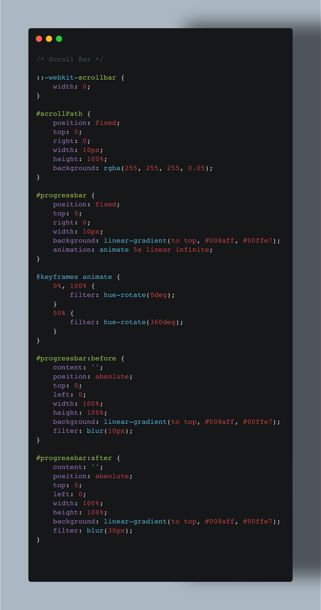
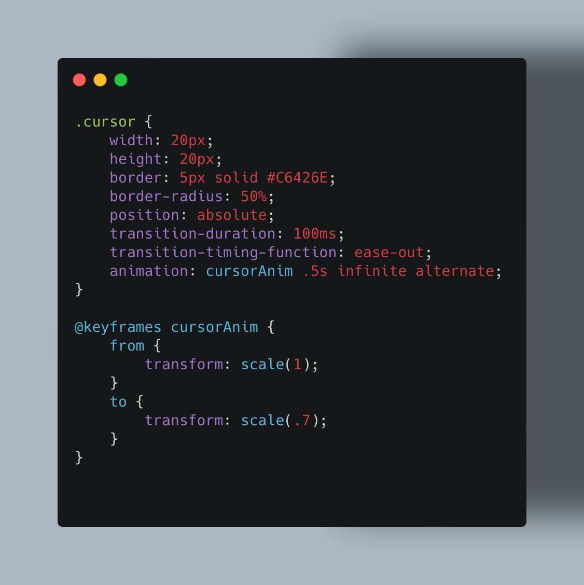
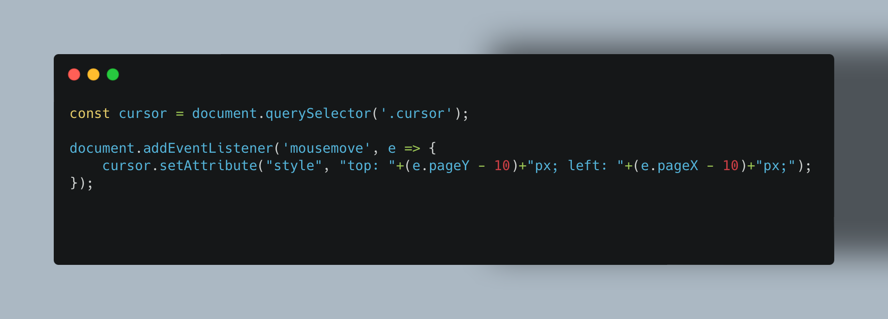
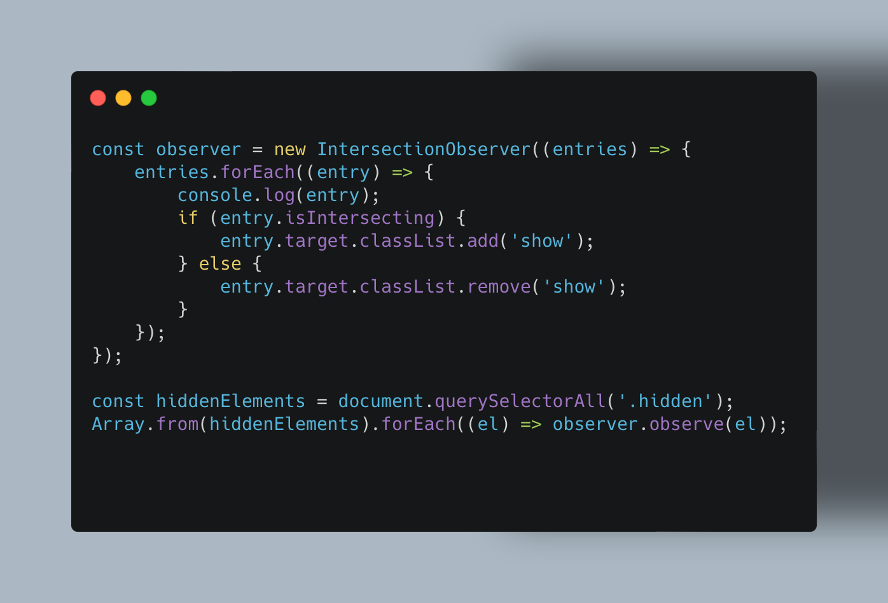
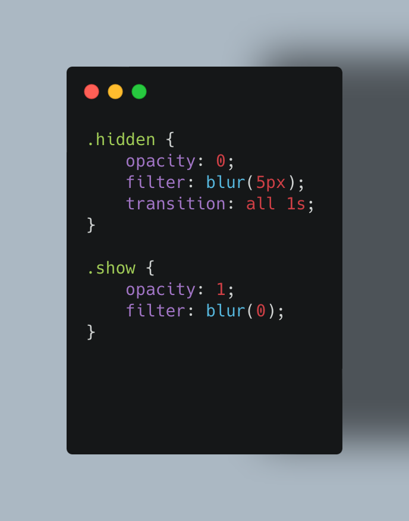

- I chose to use Vanilla CSS as apposed to Tailwind because

# Welcome to my Software Story

Over the past few years have really since finishing my Computer Science degree I have really been on a journey discovering new things about myself and discovering what I wanted to do long-term as for my career. I am a person that lives their life by following there passion and this is way I am currently pursuing a career in Software/Web development.

## The Website Inspiration

I have spent the past year creating all different types of websites for business clients through my freelance side hustle [AcquahXWeb](https://acquahxweb.com/) after teaching myself how to build websites as I did not learn this on my Computer Science undergraduate course. I have had the pleasure of building small E-Commerce websites, working with a local General Practice and helping improve small businesses by trying to make their lives a little bit easier anyway I can. Throughout this experience I have learnt that building software and web solutions is something I want to be doing long-term. 
For this website I wanted to take a minimalist design to showcase some of the more intricate skills I have learnt over the years that not everyone would notice but definitely add to the overall user experience when using a website.

## My Website

-**Creative ScrollBar**: '::-webkit-scrollbar': This pseudo-element targets the default scrollbar in WebKit-based browsers and sets its width to 0, basically hiding it.

#scrollPath: This element represents the vertical bar that appears on the right side of the page. It is positioned fixed and has a width of 10px and a height of 100%. It has a semi-transparent background color.

#progressbar: This element represents the actual progress bar that fills up as the page is scrolled. It is positioned fixed and has a width of 10px. It uses a linear gradient background color that transitions from #008aff to #00ffe7. It also has an animation called "animate" applied to it, which gradually changes the hue of the progress bar.

@keyframes animate: This keyframe animation is applied to the #progressbar element. It specifies the animation duration, timing function, and the keyframe percentages.
The animation gradually rotates the hue of the progress bar's background color from 0 degrees to 360 degrees, creating a colorful effect.

-**Custom Cursor Styling**: The .cursor class styles the custom cursor element. It sets the width and height to 20 pixels and adds a 5-pixel solid border with a color of #C6426E. The border-radius: 50% creates a circular shape for the cursor. The position: absolute positions the cursor element relative to its nearest positioned ancestor. The transition-duration and transition-timing-function properties control the smooth transition when the cursor style changes. The animation property applies the cursorAnim animation to the cursor element. The cursorAnim animation scales the cursor from its initial size to a smaller size and repeats infinitely.

-**Custom Cursor Movement**: This JavaScript code listens for the mousemove event on the entire document.
When the mouse moves, the event handler function updates the position of the cursor element by modifying its top and left CSS properties. The e.pageX and e.pageY values represent the mouse pointer's coordinates relative to the document. The cursor.setAttribute() method sets the inline style attribute of the cursor element, updating its position based on the mouse coordinates.

-**Scroll Fade Effect**: This code sets up an Intersection Observer to track the visibility of elements with the hidden class. The observer's callback function receives an array of entries representing the observed elements. For each entry, the code checks if it is intersecting with the viewport using entry.isIntersecting. If an element is intersecting (i.e., becomes visible in the viewport), it adds the show class to the element. If an element is not intersecting (i.e., goes out of the viewport), it removes the show class from the element. The show class is used to apply CSS transitions or animations to fade in or reveal the hidden elements.

-**Scroll Fade Effect Styling**: The .hidden class defines the initial styling for hidden elements. I set the opacity to 0 to make the element fully transparent. I applied a blur filter with a value of 5px to give a blurred effect to the element. The transition property specifies that all CSS properties should transition with a duration of 1 second when the class is added or removed. The .show class is applied to elements when they become visible in the viewport. The .show class sets the opacity to 1 to make the element fully opaque. It removes the blur filter by setting filter: blur(0) to restore the element's sharpness.

